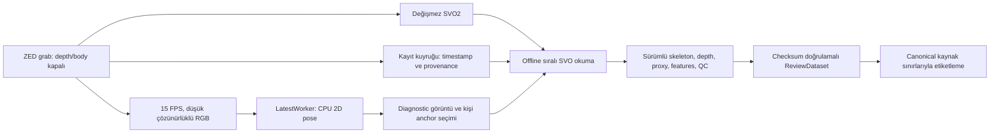

# Backend mimari uygulama raporu — 11 Eylül 2026

> **Bu raporun izi:** [6V hafıza kaydı](../memory/6v-6v-capture-verileri-hesapla-etiketleme-backend-devami-2026-09-11.md) · [Veri hattı](../../concepts/pipeline.md)
>
> Tarihsel rapor. Güncel durum için [MEMORY_INDEX](../../../MEMORY_INDEX.md) kullanılır.


Durum: **donanımsız uygulama ve ilgili kontroller tamamlandı; yeni canlı ZED kaydıyla doğrulama bekleniyor.**

Bu çalışma `3706cbe` commit'indeki yarım kalmış backend değişikliklerinin devamıdır. Önceki buffer ownership, kayıt sınırı ve kapanış düzeltmeleri korundu. Yeni çalışma henüz commit edilmedi. Kullanıcının “tüm yeni kayıtlarda minimum ham kayıt varsayılan olsun” kararı ve son mimari dosyasındaki **Capture → Verileri Hesapla → Etiketleme** yönü uygulandı.

## 1. Sonuç ve sınır

Yeni uygulama profili HD720/60 FPS, H264_LOSSLESS SVO2 ve minimum canlı hesaplama ister. Bu bir **istenen profil**dir; bu makinede canlı kamera açıkken kesintisiz 60 FPS veya codec'in gerçek dosyada bilgi koruması henüz kanıtlanmadı. SDK profil uyuşmazlığı, kaynak sayımı ve yeniden açma kontrolleri bu ayrımı görünür tutar. Codec başlatılamazsa sessiz bir kayıplı codec geçişi yapılmaz.

Eski take/session belgeleri tarihsel profilleriyle okunur. Eski kullanıcı tercihleri diske yazılmadan yeni minimum profil ve HD720/60 varsayılanına çevrilir; kullanıcının daha sonra açıkça kaydettiği policy-2 ayarları korunur. Doğrudan eski mock/legacy test akışı ayrıca çalışır. Üretim PySide6 arayüzü yeniden tasarlanmadı; gerekli ayar metni, ham kayıt okuma ve piksel uzayı uyumluluğu düzeltildi. Yeni WinUI3 arayüzü, kurulum paketi ve performans garantisi bu teslimin parçası değildir.

## 2. Uygulanan veri akışı



### Capture ürünlerinin gerçek maliyeti

| Ürün | Yeni varsayılan | Gerçek davranış |
|---|---|---|
| Stereo SVO2 | Açık | SDK native kayıt; gerçek backend için yeniden işlenebilir kaynak zorunlu |
| Zaman damgası/indeks/provenance | Açık | Hafif kayıt kuyruğu, JSONL ve atomik metadata |
| Canlı SDK body/depth inference | Kapalı | SDK modülleri etkinleştirilmez; runtime depth kapalı |
| Tam çözünürlük RGB kopyası | Kapalı | Proxy veya ayrı renk ürünü açık olmadıkça yapılmaz |
| Canlı metrik depth retrieval/kopya/arşiv | Kapalı | İlgili retrieve, ownership kopyası, sıkıştırma ve disk yazımı çalışmaz |
| Canlı final skeleton dosyası | Kapalı | Skeleton writer açılmaz; body JSON dönüşümü yapılmaz |
| Proxy video | Kapalı | Video encoder/writer açılmaz |
| Ayrı RGB arşivi | ZED'de kapalı | Mock için saklanan renk ve sentetik üretici provenance'ı korunur |
| Hafif RGB önizleme | Açık, hedef 15 FPS/640 px | SDK'dan yalnız gereken küçük görüntü alınır |
| Hafif 2D pose | Diagnostic'te ayrı CPU işçisi | SVO yakalama akışına inference beklemesi eklenmez |

`CaptureProfile` ürün anahtarlarını ve `computes_body`, `computes_depth`, `retrieves_depth`, `requires_full_rgb` bağımlılıklarını açıkça taşır. Açıkça seçilen ek ürünün maliyeti tekrar devreye girer. Bu ürünler için 60 FPS sözü verilmez.

### Canlı önizleme

`LatestWorker` tek bekleyen kare tutar. Yeni kareyi sunmak bloke olmaz; işçi veya tüketici yavaşsa önizleme karesi atılır. Kullanıcı frame callback'leri de acquisition thread'inden çıkarıldı. Testte pose işçisi ve ayrıca frame listener kasıtlı olarak durdurulurken kayıt ilerlemeye devam etti.

Hafif pose sağlayıcısı OpenCV DNN üzerinde **CPU** kullanır; GPU inference final dataset hesabına ayrılır. OpenCV Zoo'nun Apache-2.0 lisanslı MediaPipe person/pose modelleri kullanıldı. Önizleme çıktısı 2D'dir; metrik ZED iskeleti veya katılımcı kimliği olarak saklanmaz. Kaynaklar: [person detector](https://github.com/opencv/opencv_zoo/tree/47534e27c9851bb1128ccc0102f1145e27f23f98/models/person_detection_mediapipe), [pose estimator](https://github.com/opencv/opencv_zoo/tree/47534e27c9851bb1128ccc0102f1145e27f23f98/models/pose_estimation_mediapipe).

Yeni paket kurulmadı. Model verileri `C:\Users\gorke\.cache\kinecapture\models` altında; başlangıçta otomatik indirme yapılmaz. Açık indirme komutu model boyutunu ve LFS SHA-256'sını doğrular. Vendored Python kodunun lisansı ve kaynak commit'i repository'de tutulur; NMS kutu biçimi düzeltildi ve kullanılmayan segmentation maskesi dönüştürmesi çıkarıldı.

Model hash'leri:

- Person: `47fd5599d6fa17608f03e0eb0ae230baa6e597d7e8a2c8199fe00abea55a701f`, 11,990,159 byte.
- Pose: `9d89c599319a18fb7d2e28451a883476164543182bafca5f09eb2cf767ed2f3f`, 5,557,238 byte.

Operatör tıklaması **gösterilmiş kareye** bağlanır: kamera timestamp'i, backend frame ordinal'i, kaynak çözünürlüğü, tıklama noktası ve bbox. Önizleme detection sırası kimlik değildir. Offline işleme aynı timestamp'te bbox/noktayla tek bir kişi eşleyemezse seçimi uydurmaz. Sonradan düzeltme gerekiyorsa `--subject-anchors` ile yeni işleme parametresi verilir; ham anchor dosyası değiştirilmez. Kayıt öncesinde seçilmiş fakat kaynakta bulunmayan anchor ayrıca raporlanır.

## 3. Bütünlük ve kapanış

- SDK depth ve body dizileri SDK scratch belleğinden ayrılmış, owned/read-only snapshot'lardır. Arşiv yazıcısına dışarıdan mutable dizi verilirse de saklanan kareler korunur. Zaten owned/read-only olan dizi için ikinci tam kopya yapılmaz.
- Body_18/34/38 eklem sırası değiştirilmez. Yanlış zorunlu eklem/confidence şekli bütünlük sorunu olarak işaretlenir. SDK retrieval hatasından eski veri döndürülmez. Body timestamp'i görüntü timestamp'iyle uyuşmazsa veya sonuç yeni değilse iskelet kullanılmaz.
- İskelet JSON'unda sonlu float32 değerler ondalık yuvarlama olmadan geri okunur. Non-finite değerler `null`/NaN eksik veri sözleşmesini izler; depth chunk'ı float32 kayıpsızdır.
- Native start/stop, `grab + enqueue` sınırının içinden geçemez. Mutex bekleyen kontrol işlemlerinin acquisition tarafından aç bırakılması öncelik event'iyle önlenir.
- Dolu/dead kuyruğa sentinel koyarak kapanış beklenmez. Writer durmadan dosyaları kapatma/finalize etme yasaklanır. Timeout'ta sahiplik korunur, tekrar kapanış denenebilir.
- Kayıt kuyruğu kaybı, backend drop delta'sı, timestamp sorunları, bozuk/eksik istenen ham ürün ve eksik/boş SVO2 başarılı take olarak yayımlanmaz.
- JSONL flush/fsync hatası artık yutulmaz. Payload checksum'ları final `take.json` commit'inden önce yazılır. Sonradan değişebilen insan notları `take.json` checksum'ına bağlanmaz.
- Aynı tracker ID, büyük konum/anatomi çelişkisini otomatik olarak geçersiz kılamaz. Belirsiz kimlik manuel onay olmadan yeniden kilitlenmez. Kişi kapsamı paydasına belirsiz kareler de dahildir.

`frame_index`, canlı ZED'de fiziksel kamera sayacı değildir: **başarılı grab ordinal'idir**. Native SVO pozisyonuyla eşit olduğu varsayılmaz. Ham kaydın finalization durumu, offline SVO kapsam doğrulamasının yerine geçmez; manifest eşlemeyi `pending_offline_timestamp_reconciliation`, take ise `awaiting_processing` olarak taşır. SDK ingested/encoded sayaçları ayrı saklanır, doğrulanmış sayım sayılmaz.

## 4. Offline katman ve etiketleme sınırı

`process_take` GUI'den bağımsızdır. ZED kaynağını `svo_real_time_mode=False` ile sırayla okur. Hesaplama süresi frame seçimini belirlemez. Varsayılan BODY_38 / HUMAN_BODY_ACCURATE / NEURAL_PLUS / fitting açık / reduced-precision kapalıdır. Calibration dosyası değişikliği içerik hash'iyle provenance'a girer.

Her deneme `derived/processing/.run_<id>.partial` altında başlar. Kaynak hash'i/provenance, parametreler, SDK ve calibration bilgisi, durum, ilerleme ve hata `job.json` içinde kalır. Başarılı sonuçlar ancak akışlar kapandıktan, kapsam/QC ve checksum kontrolünden sonra aynı filesystem'de atomik rename ile `run_<id>` olarak yayımlanır. İptal, hata veya eksik kaynak hiçbir zaman complete sonuç olarak sunulmaz. Restart eski çıktıya ekleme yapmaz; tracker geçmişini yeniden oluşturmak için kaynağı baştan okuyup **yeni deneme** açar. Kaynak değişmişse restart reddedilir.

Ürünler: tüm algılanan body alanlarını koruyan `skeleton.jsonl`, exact `source_map.jsonl`, seçilmiş kişinin `arrays.npz` dizileri, confidence/maskeler, istenen features, schema/spec, isteğe bağlı depth chunk'ları ve review proxy. Subject seçilmemişse kişi dizileri NaN/maskeli kalır; en iyi görünen gövde katılımcı yerine konmaz.

SVO/capture eşleme kuralı bu SDK için doğrulanmış mikrosaniye çözünürlüğünde **tekil timestamp eşitliği**dir. Yakın komşu, yaklaşık sıra kaydırma veya `N−1 normaldir` düzeltmesi yoktur. Kaynak pozisyonu, tekrar eden/geriye giden zaman, 1.5 frame aralığından büyük boşluklar, declared/decode sayısı ve eşlenmeyen canlı kayıt kareleri raporlanır.

`ReviewDataset` SDK/Qt import etmeden complete sürümü checksum'larıyla açar. Hazır iskelet, video ve dizilere erişir. Yeni etiketler kaynak fingerprint'i + SVO pozisyonu + camera timestamp sınırlarıyla, inclusive aralıklar halinde ayrı `annotations/processing/run_<id>.json` sidecar'ına yazılır. Eski `segments.json` ve eski akış-konumu anlamı otomatik değiştirilmez. Bu API yeni WinUI3 için temeldir; mevcut production etiketleme ekranına yeni bir işleme yönetimi arayüzü eklenmedi.

## 5. Gerçekten çalıştırılan doğrulama

Kanıt dizini: `C:\Users\gorke\AppData\Local\Temp\kcb_8af98122`.

| Kontrol | Sonuç |
|---|---|
| Backend, storage, RGB-D, subject lock, features, export, config kapsamı | 246 testin 244'ü ilk seferde geçti; iki eski ürün varsayımı testi güncellendi |
| Bu iki düzeltmeyi ve güncel processing/capture/SDK yollarını içeren takip kapsamı | **63 passed, 11.87 s** (`remaining13.xml`) |
| Capture GUI + genel GUI uyumluluğu | **56 passed, 22.18 s** (`gui12.xml`) |
| Üç body formatında SDK → disk → playback, yeni defaults/anchor/processing | **38 passed, 5.24 s** (`final14.xml`) |
| Kapanış, eksik native kaynak, orta-akış iptali, preview izolasyonu | **23 passed, 7.18 s** (`closure16.xml`) |
| Modül-fixture kullanıcı tercih izolasyonu ve user-state testleri | **6 passed, 3.96 s** (`isolation15.xml`) |
| Sentetik uçtan uca self-test | exit 0; 66 kare, playback, etiketleme, ham arşiv ve export doğrulaması geçti |
| Processing/review import sınırı | yeni Python sürecinde PySide6/pyzed import edilmedi |
| `git diff --check` | geçti |

Bu sayılar birbiriyle örtüşür; toplanarak benzersiz test sayısı olarak sunulmaz. Tam pytest çalışması başlatıldı, GUI testlerinde uzun beklemeler sırasında kesildi; **tam paket geçti iddiası yoktur**. İlk denemelerde uygulama/test hataları bulundu ve ilgili kontroller tekrarlandı. Wheel/install ve tüm GUI matrisi bu teslimde tamamlanmadı.

### Yeni gerçek SVO gözlemleri

1. Eski B kaydında yeni offline RGB/proxy yolu: bildirilen 230, okunan **229** kare; bütün okunabilir kareler sırasıyla işlendi. Sonuç `partial`; `source_frame_count_mismatch` ve `capture_frames_unmatched` gerekçeleri var. Timestamp max gap **33.424 ms**, gap std **0.05975 ms**, 1.5 aralıktan büyük boşluk **0**. Artifact: `svo_pipeline/.run_9562dcb98445424a.partial`.
2. Yalnız üç karelik gerçek SDK depth ownership kontrolü: önce saklanan depth hash'leri sonraki SDK okumalarında değişmedi; üç hash birbirinden farklı; üç dizi owned/read-only. Artifact: `bounded_depth_preview.json`.
3. Aynı üç kayıtlı görüntüde CPU hafif pose: her karede bir kişi; **153.9 / 99.3 / 99.3 ms**. Bunlar inference örnekleridir; canlı preview veya çok kişili sahne FPS garantisi değildir. Aynı kaynakta SDK'nin gördüğü tüm kişileri bu hafif modelin gördüğü iddia edilmez.
4. Üç karelik gerçek yüksek kaliteli BODY_38 okuması: her karede iki body, her birinde 38 eklem; image/body timestamp ve yeni-veri kontrollerinde issue yok. Artifact: `bounded_sdk_body38.json`.
5. İki saniyelik sentetik diagnostic: ara örnekte kaynak **58.55 FPS**, kayıt kuyruğu kaybı **0**, pose önizleme tamamlanan **14**, önizleme atlanan **45**; take finalized. Bu bir ZED hız testi değildir.

### Kullanıcı verisi ve test izolasyonu

Eski baseline'daki 15 kullanıcı dosyası yeniden hash/mtime ile karşılaştırıldı. Kayıt dosyaları ve gerçek kimlik DB'si korunmuştu; tam test çalışmasının `test_gui_viewports.py` modül-scope fixture'ı gerçek `user_state.yaml` içine test yolunu yazmıştı. Function-scope izolasyonun modül fixture setup'ından sonra çalışması kök nedendi.

Bozulmuş dosya kanıt dizinine yedeklendi. Önceki bu görev oturumunun dosya okuma çıktısından özgün byte dizisi elde edildi ve **yalnız eski SHA-256 ile birebir eşleştiği doğrulandıktan sonra** tercih dosyası geri yüklendi; mtime da eski baseline değerine döndürüldü. Session-scope dış izolasyon eklendi; ilgili modül fixture'ı gerçek tercih yoluna erişiyorsa GUI kurulmadan test hata veriyor. İlgili kontrol tekrar geçti. Eski tercihin zaten var olmayan eski pytest dataset yolunu içerdiği biliniyor; bu önceden var olan ürün tercihi bu onarım sırasında başka bir yola çevrilmedi. Diagnostic daima açık `--output` ister ve kullanıcı tercihlerini kullanmaz.

Son testlerden sonraki nihai kontrolde **15/15 dosyanın SHA-256 ve mtime değerleri başlangıçla birebir eşleşti**; değişen dosya yok. Kanıt: `protected_data_final.json`.

## 6. Sürümler

App/package **0.11.0**; capture policy **2**; take **1.2.0**; skeleton stream **1.2.0**; raw archive **1.1.0**; processing **1.0.0**; canonical annotation sidecar **1.0.0**; subject association **1.1.0**. Project **1.1.0**, session **2.0.0**, eski annotation/release **2.2.0**, label **2.0.0**, feature spec **1.0.0**, identity SQLite **1** olarak kaldı.

## 7. Kullanım ve donanımda kalan doğrulama

Yalnız mevcut KineSynth Python kullanılır:

```powershell
& C:\Users\gorke\anaconda3\envs\KineSynth\python.exe -B -m kinecapture.tools.capture_diagnostic --backend mock --output C:\temp\kc-diagnostic --seconds 10 --no-display
& C:\Users\gorke\anaconda3\envs\KineSynth\python.exe -B -m kinecapture.processing <take-directory>
& C:\Users\gorke\anaconda3\envs\KineSynth\python.exe -B -m kinecapture.processing --restart <partial-job-directory>
```

Kamera bağlandıktan sonra küçük bağımsız diagnostic viewer ile yeni HD720/60 SVO2 kaydı alınacak. Görüntülü/görüntüsüz ve preview kapalı koşullarında kaynak FPS, kayıt kuyruğu kaybı, SDK dropped/ingested/encoded sayaçları, timestamp gap/jitter, kapanış ve dosyanın yeniden açılıp okunabilir kare/timestamp kapsamı karşılaştırılacak. Kayıt sırasında kişi tıklaması yapılıp yeni BODY_38 offline işleme ve canonical source eşleme doğrulanacak. Viewer'da `--no-display` çizimi, `--no-preview` retrieval/pose önizlemesini, `--no-pose` yalnız 2D inference'ı kapatır.

**Bilinmeyenler:** canlı 60 FPS sürdürülebilirlik; lossless SVO2'nin gerçek bilgi koruması/kapasite sınırı; bu SDK'da kayıt sayaçlarının güvenilirliği; kişi seçiminin çok kişili canlı sahnede başarısı; yeni düzgün kapanmış SVO'da sınır düzeltmesinin bir-kare farkını giderip gidermediği. Önceki squat BODY_34/BODY_38 gözlemi yeni bir kontrollü squat kaydıyla tekrarlanmadı. Geçmiş depth farkındaki büyük hatalar ownership kusuruyla karıştığı için bunlardan SDK derinlik modeli hakkında yeni kesin sonuç çıkarılmadı.
