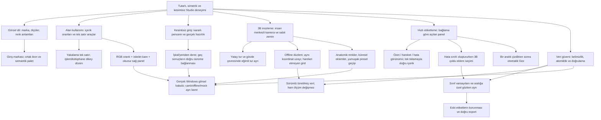

# Studio GUI — fikir haritası ve tasarım gerekçeleri

> 20 Eylül eki: Üstte üç kaydırmasız yardımcı sekme ve altta iki modlu
> etiketleme editörü için [güncel fikir haritasına](studio-gui-repair-2026-09-20.md)
> bak. Bu notun ilgili eski yerleşim ayrıntıları yeni kararla değişmiştir.

## Durum ve kullanım

`decision`: Kullanıcı tasarım yaklaşımını 19 Eylül 2026'da onayladı.
Bu harita ürün kararları arasındaki ilişkileri gösterir; uygulama fazlarının
sırasını belirlemez. Claude kodu inceleyip faz planını kendisi oluşturacak,
Obsidian'a kaydedecek ve kullanıcı onayı beklemeden bütün fazları uygulayacak.
Rutin ara açıklamalar yerine her fazın sonucu Obsidian'a işlenecek; kullanıcıya
bütün fazların sonunda tek nihai rapor verilecek. Kullanıcı eylemi gerektiren
gerçek engeller kısa biçimde bildirilebilir. `open`: Uygulama, kök neden teşhisi ve performans
doğrulaması bu tasarım görüşmesinde yapılmadı.

- [Onaylı ayrıntılı tasarım](studio-gui-refinement-2026-09-19.md)
- [Claude'a verilecek görev promptu](../../promts/CLAUDE_STUDIO_GUI_FINAL_REFINEMENT_PROMPT_2026-09-19.md)
- [Bellek giriş haritası](../../MEMORY_INDEX.md)

Ayrıntılı gereksinimler promptta sabit kimliklerle yer alır. Bu harita aynı
metni çoğaltmadan “neden bu karar alındı?” ve “neyi etkiler?” sorularını yanıtlar.

## Fikir haritası

## Kararların gerekçeleri

| Karar | Kullanıcı açısından neden | Korunacak sınır / prompt kimlikleri |
|---|---|---|
| Ortak ölçü ve ikon dili | Küçük hizalama farkları da arayüzün özen hissini belirliyor. | Semantik renk, kontrast ve klavye erişimi; `UI-01`–`UI-04`. |
| Markalı, simetrik giriş | Sadelik korunurken ürün kimliği güçleniyor. | Logo oranı/kimlik doğrulama korunur; `LOGIN-01`–`LOGIN-02`. |
| Yakalamada kontrol ve telemetriyi birleştirme | İki satırın harcadığı alan görüntüye ve sağ panele döner. | İstenen sıra ve gerçek sayaçlar; `CAP-01`–`CAP-03`. |
| Dikey işlem listeleri ve dengeli kütüphane | Çok öğeyle tarama kolaylaşır, ayrıntı sıkışmaz. | Önbellek/asenkron metadata; `PROC-01`–`PROC-02`, `LIB-01`–`LIB-02`. |
| Hazırlık bitince editörü birlikte açma | Donma ve sonradan beliren parçalardan oluşan deneyim giderilir. | Gerçek ilerleme, iptal ve geç sonuç güvenliği; `LOAD-01`–`LOAD-04`. |
| Üç bant ve birleşik üst yüzey | RGB, 3B ve düzenleme bir işin parçaları gibi görünür. | Gerçek video oranı, 1:1 iskelet, okunur panel; `LAYOUT-01`–`LAYOUT-02`. |
| İki fare dönüş modu | En yaygın yatay inceleme basit; üst/alt inceleme ayrı ve kontrollü. | Eksen ile bakış hedefi farklıdır; `CAM-01`–`CAM-04`. |
| Sabit, offline çıkarılmış zemin | Zıplama ve yer değiştirme fiziksel referansını kaybetmez. | Dünya/kamera uzayı, başarısız tespit ve eski kayıt; `FLOOR-01`–`FLOOR-04`. |
| Küresel düğüm, anatomik renk, yumuşak kamera | Derinlik, taraf ve yön daha kolay okunur. | Ölçümü filtrelemeden görsel iyileştirme; `SKEL-01`–`SKEL-03`, `PRESET-01`–`PRESET-03`. |
| Üç içerikli etiket sekmesi | Listeye bakma ve aralık düzenleme aynı panelde doğru bağlama geçer. | Tek tıklama; renk yanında açıklama; `PANEL-01`–`PANEL-02`, `LABEL-01`–`LABEL-04`. |
| Sınıf oluştururken eklemi görerek seçme | Uzun anatomik isim listesi ve her aralıkta tekrar seçim ortadan kalkar. | Çift tıklama/drag ayrımı ve geçerli rol; `JOINT-01`–`JOINT-03`. |
| Varsayılan ilişki ile gözlemi ayırma | Hızlı kullanım yanlış bilimsel kanıt üretmez. | Eski etiket sessizce değişmez; `JOINT-04`, `EXPORT-02`. |
| Çizimden sonra Gez | Sonraki tıklamayla istemeden yeni aralık çizilmez. | Yeni aralık seçili ve düzenleyici açık kalır; `TOOL-01`–`TOOL-03`. |
| Kişi/Veri Seti/export bağlamını koruma | Eksikliği görüp doğru kayıtta düzeltmek kolaylaşır. | Kimlik ve readiness kapıları; `PERSON-01`, `DATA-01`, `EXPORT-01`–`EXPORT-02`. |
| Merkezi bildirim katmanı | Mesaj okunur ve kapatılabilir olur. | Ana girişleri yemeyen katman; `NOTICE-01`–`NOTICE-02`. |

## Birbirine karıştırılmaması gereken kavramlar

1. **Dünya zemini, kamera hedefi, kamera dönüş ekseni:** zemin sabit olabilir,
   bakış gövdeyi hedefleyebilir, yatay tur ayakların arasındaki düşey eksen
   etrafında yapılabilir. Bu üçü aynı her-kare merkezleme işlemine indirgenmez.
2. **Görsel yumuşatma ve ölçüm filtreleme:** kenarları yumuşatmak eklem dizisinin
   hareketini değiştirmek değildir. NaN ve ham koordinatlar korunur.
3. **Sınıf varsayılanı ve aralık gözlemi:** bir kez tanımlanan eklemler her
   aralıkta ayrı ayrı incelenmiş sayılmaz. Köken ve eski kararlar korunur.
4. **Hata içeriyor, etiket eksik, hazır:** kırmızı/kehribar/yeşil bu ayrı
   durumları anlatır. Sınıfsız veya incelenmemiş hareket sırf hata eklenmedi
   diye yeşil değildir.
5. **Görsel boşluk ve kullanılabilir alan:** tüm panelleri aynı anda sınırsız
   büyütmek mümkün değildir. Gerçek en-boy oranları, minimum sağ panel ve
   timeline yüksekliği birlikte çözülür.
6. **Tasarım onayı ve uygulama kanıtı:** kullanıcı onayı işin hedefini
   kesinleştirir; teknik teşhis, performans ve veri uyumluluğu yine test edilir.

## Teknik belirsizlikler — kullanıcı onayıyla kapanmadı

- `open`: Pencerenin kaybolmasının gerçek kök nedeni. Sonradan eklenen GL
  bileşeni bir hipotez; ilk/tekrarlanan giriş ayrı gözlenecek.
- `open`: Yüklemedeki hangi alt adımın GUI'yi tuttuğu ve doğru ready sınırı.
- `open`: Kurulu ZED sürümü/SVO'larla zemin tespiti ve referans dönüşümleri.
- `open`: Küresel düğüm/picking/kenar yumuşatma için uygun yöntem ve maliyet.
- `open`: Sınıf-eklem varsayılanlarının mevcut şema/registry/export'a en dar,
  kayıpsız entegrasyonu ve atomik yazım/undo sınırı.
- `open`: Toast katman sorununda gerçek stacking/clipping yaşam döngüsü.

Bu soruların yanıtı Claude'un inceleme, plan ve uygulama kayıtlarında
kanıtlarıyla yer almalı; bu harita bir yöntem dayatması değildir.

## Uygulama kayıtlarıyla ilişki

Claude bu iki dosyayı 19 Eylül 2026'da oluşturdu:

- [Faz planı ve kapsam tablosu](../plans/studio-gui-refinement-implementation.md)
- [Çalıştırılan doğrulamalar](../reports/studio-gui-refinement-validation.md)

Yukarıdaki teknik belirsizliklerden `LOAD-01`, `LOAD-02` ve `NOTICE-01` kök
nedenleri gerçek pencerede ölçülerek kapandı; ayrıntı doğrulama raporunda.
Bu görüşmede faz planı hazırlanmadı ve uygulama başlatılmadı; ikisini de
Claude'un oturumu yaptı.

Kaynak: 19 Eylül 2026 kullanıcı isteği, tasarım değerlendirmesi ve aynı
oturumdaki açık onay; Codex oturumu `01a0b73e-0a13-7be0-a8ad-eb03e808cc4d`.
Ham konuşma ve görüntüler burada çoğaltılmadı.
