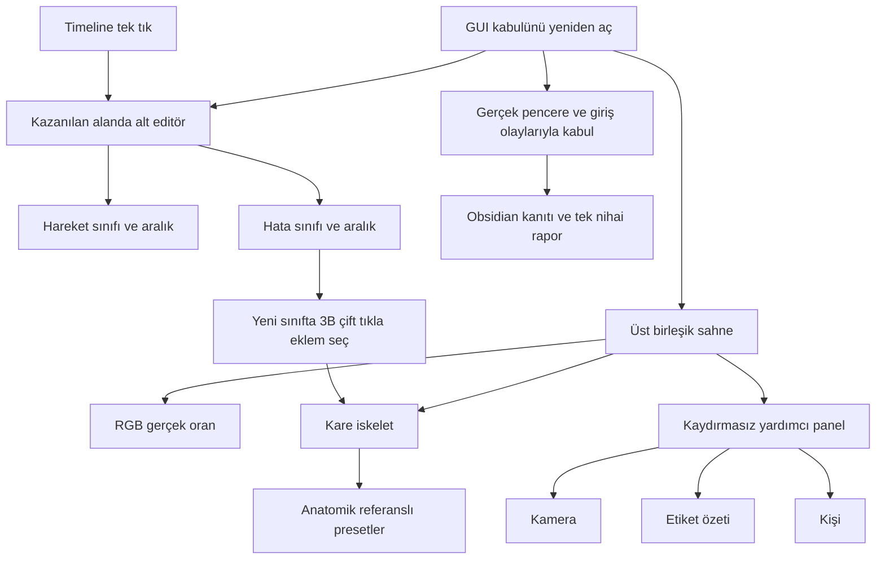

# Studio GUI — alan kullanımı ve etiketleme düzeltme yönü

`decision`: Kullanıcı 20 Eylül'de kaydırmalı sağ paneli reddetti; kullanılmayan
alanın etiketleme için değerlendirilmesini, eklem seçiminin iskelet üzerinden
olmasını ve presetlerin doğru yönleri göstermesini istedi. Bu not bir ürün
kararıdır, uygulanmış/ölçülmüş başarı değildir.

- Üst birleşik RGB + kare 3B + yardımcı panel korunur.
- Üst panel: kamera / etiket özeti / kişi; sağda dikey ikonlar; panel içi
  kaydırma yok. Taşan ayrıntı ayrı sekme veya mini pencereye gider.
- Kullanıcının önerdiği yön esas alınır: kazanılan alt alanda ayrı editör,
  hareket ve hata olmak üzere iki bağlamsal mod. Timeline tek tıkla doğru
  modu açar. Eski üst panelin üç etiket varyantı bu düzenle ayrıştırılır.
- Yerleşim başlangıç önerisi: üst sahne → yatay alt editör → tek toolbar →
  timeline. Kesin piksel/alt bölge paylaşımını Claude gerçek ölçülere göre
  belirler; temel sahneyi küçülterek veya metni keserek sığdırmak yok.
- Sınıf eklerken düğüme çift tık, çoklu seçim, kamera ile inceleme ve açık
  taslak/iptal akışı; mevcut sınıf tekrar etiketlenirken eklemleri yeniden
  seçmek gerekmez. Eski checkbox listesi ana etkileşimden çıkarılır.
- Anatomik preset referansı veri/kalibrasyonla kurulur; mevcut sanal kameranın
  azimutu anatomik ön sayılmaz. Kayıt kamera yönü ayrı kavramdır.
- Kaydırma yasağı ve alt panel, önceki tasarımın ilgili maddelerini
  `superseded` eder; diğer gereksinimler korunur.
- Claude fazları kendi planlar; onay beklemeden uygular, her fazı Obsidian'a
  kaydeder, tüm işten sonra tek rapor verir.

[Denetim ve nedenler](../audits/studio-gui-acceptance-audit-2026-09-20.md) ·
[Uygulama görevi](../../promts/CLAUDE_STUDIO_GUI_ACCEPTANCE_REPAIR_PROMPT_2026-09-20.md) ·
[Önceki tasarım](studio-gui-refinement-2026-09-19.md) ·
[Önceki fikir haritası](studio-gui-design-map-2026-09-19.md)
